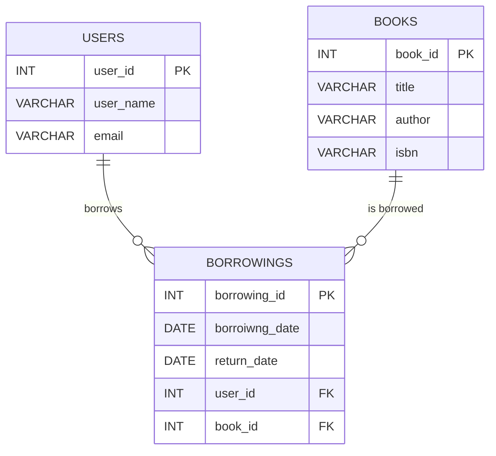

```mermaid
erDiagram
    USERS {
    INT user_id PK
    VARCHAR user_name
    VARCHAR email
    }

    BOOKS {
    INT book_id PK
    VARCHAR title
    VARCHAR author
    VARCHAR isbn
    }

    BORROWINGS {
    INT borrowing_id PK
    DATE borroiwng_date
    DATE return_date
    INT user_id FK
    INT book_id FK
    }

USERS ||--o{ BORROWINGS : "borrows"
BOOKS ||--o{ BORROWINGS : "is borrowed"
```