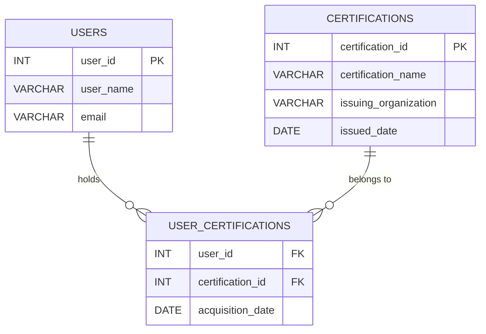

```mermaid
erDiagram
    USERS {
        INT user_id PK
        VARCHAR user_name
        VARCHAR email
    }

    CERTIFICATIONS {
        INT certification_id PK
        VARCHAR certification_name
        VARCHAR issuing_organization
        DATE issued_date
    }

    USER_CERTIFICATIONS {
        INT user_id FK
        INT certification_id FK
        DATE acquisition_date
    }

    USERS ||--o{ USER_CERTIFICATIONS : "holds"
    CERTIFICATIONS ||--o{ USER_CERTIFICATIONS : "belongs to"
```