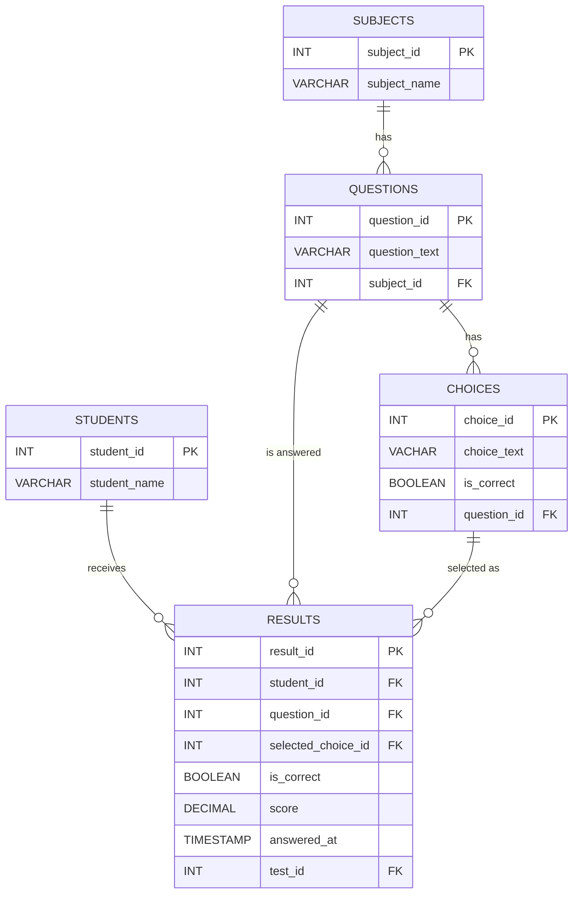

```mermaid
erDiagram
    STUDENTS {
        INT student_id PK
        VARCHAR student_name
    }

    SUBJECTS {
        INT subject_id PK
        VARCHAR subject_name
    }

    QUESTIONS {
        INT question_id PK
        VARCHAR question_text
        INT subject_id FK
    }

    CHOICES {
        INT choice_id PK
        VACHAR choice_text
        BOOLEAN is_correct
        INT question_id FK
    }

    RESULTS {
        INT result_id PK
        INT student_id FK
        INT question_id FK
        INT selected_choice_id FK
        BOOLEAN is_correct
        DECIMAL score
        TIMESTAMP answered_at
        INT test_id FK
    }

    STUDENTS ||--o{ RESULTS : "receives"
    SUBJECTS ||--o{ QUESTIONS : "has"
    QUESTIONS ||--o{ CHOICES : "has"
    QUESTIONS ||--o{ RESULTS : "is answered"
    CHOICES ||--o{ RESULTS : "selected as"
```